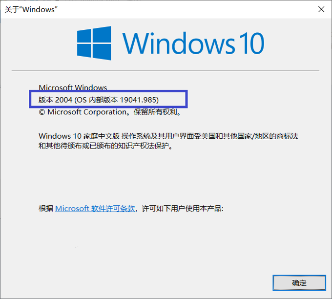
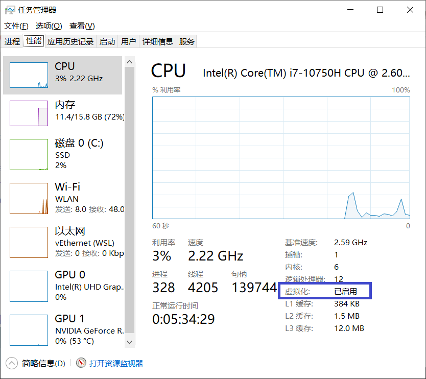

.. _install-docker:

Docker Quick Start
==================

Install on Ubuntu
-----------------

Our test shows the *apt-get* way is not working via our network.
`Download package <https://www.docker.com/get-started>`_ &
install it (`doc <https://docs.docker.com/engine/install/ubuntu/>`_)::

    # find out system architecture (amd64, armhf or arm64)
	dpkg-architecture -q DEB_BUILD_ARCH

    # then download the package, upzip
    sudo dpkg -i /path/to/package.deb

    # It's now should work
    sudo docker run hell-world

    # docker for all users not only root
    sudo groupadd docker
	sudo usermod -aG docker $USER
	# then re-login

Install on Windows 10
---------------------

Before installing Docker on Windows 10, make sure the system meet the prerequisites::

1. Windows version later than 1903 (Build 18362 or higher).

To check the system version, run *winver*.

2. Virtualization enabled

For details, see `Docker ducuments about install on Windows 10 <https://docs.docker.com/docker-for-windows/install/#system-requirements>`_.

Download the installer `here <https://docs.docker.com/docker-for-windows/install/>`_
and follow the instructions. (Install WSL later).
