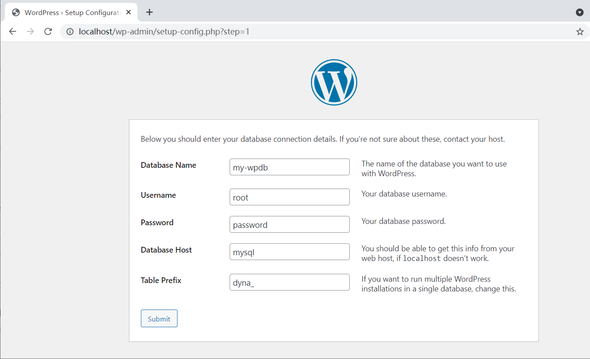
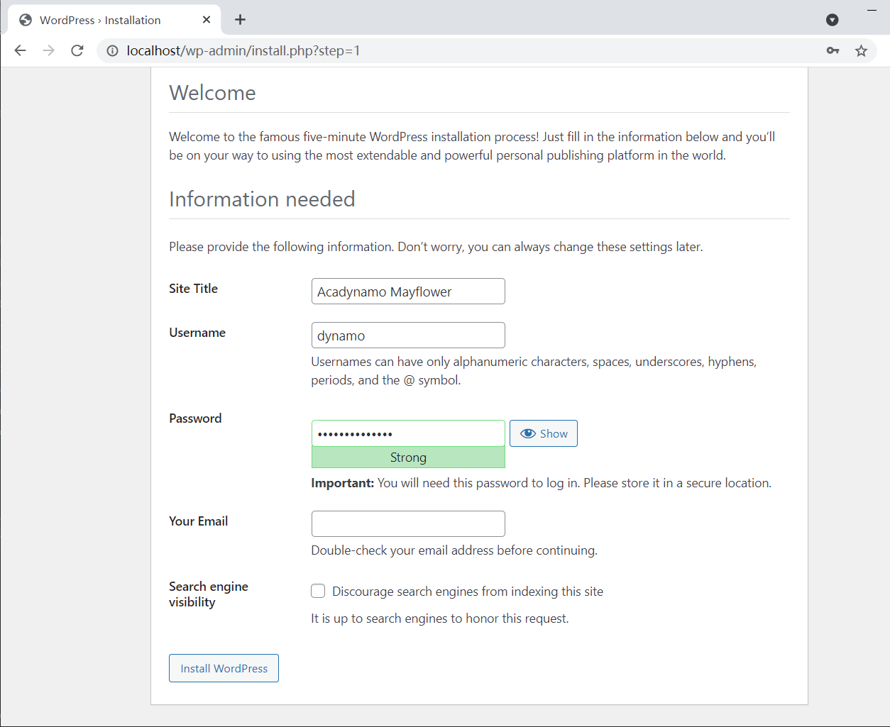

Setup Docker Wordpress
======================

Docker is getting popular in recent years. It's worth to have a try!

Docker Image: A running environment configuration.

Docker Container: A running instance of Docker image.

Install Docker
--------------

Skip this if you are folloing the :ref:`3 steps tutorial <tutor-3steps>`.

Download Docker `here <https://www.docker.com/get-started>`_.
Follow the `installation instructions <https://docs.docker.com/engine/install/ubuntu/>`_.
Or follow :ref:`the tutorial here (TODO: comming soon for Windows) <install-docker>`.

For now, you can think Docker is an advanced virtual machine and can work everywhere.
So Wordpress can provide web page service on it.

Setup Wordpress
---------------

`Wordpress <https://wordpress.org/>`_ is a website builder with support from
developers all over the world. And Docker provide us a quick way to use it.

Two different way of deploying Wordpress together with Mysql are introduced here.

.. _wp-docker-compose:

Option 1: Docker Compose
_________________________

This is the recommended simple way - composing Mysql & Wordpress.

Compose is a powerful way Docker employed for different situations. Using compose
we can setup Wordpress in one line in the same directory of
:download:`docker-compose.yml <../../../docker/wordpress/docker-compose.yml>` file::

    docker-compose up -d

This will bring up the 2 containers. With another mysql container, the mysql DB
can be connected::

    docker run --network wordpress_default -it --rm mysql:5.7 mysql -h mysql -uroot -p

The network name, wordpress_default is the name when Docker compse and run the
containers, wordpress and mysql.

.. attention:: Don't forget change the mysql's root password.

Now visit the address in a browser::

    http://localhost

and you should see something like this:

.. image:: ../imgs/02-wordpress-init.png
    :width: 320px

We are deploying Mysql with Docker using Docker Compose method. So we need to tell
where Wordpress can find database. If you didn't change anything else except password
in the download 'docker-compse.yml' file, you can set information in the page
like this::

    database name: my-wpdb
    database user: root
    database host: mysql
    db password: your-password

In this page you may still have some trouble to connect database. See troubleshootings
:ref:`details for Docker network <trouble-compose-mysql>` for how to solve the
problem.

In the next page, you can create the administrator of your website.

That's it.

Option 2: Independent Mysql Server
__________________________________

Skip this part if you are trying docker for the first time.

In this way, Mysql is running without a docker container.

::

    docker pull wordpress

Once Wordpress image is ready, we can start and run our first web server like this::

    docker run --name wp -e WORDPRESS_DB_HOST=<mysql-host>:3306 -e WORDPRESS_DB_NAME=<...> -e WORDPRESS_DB_USER=<user-name> -e WORDPRESS_DB_PASSWORD=<user-pswd> -dp 80:80 --rm wordpress

You should get something like::

    193e3fc1081e3167f631fe0b71a4fe64415a736fa64295488d8b70478287efd0

Which is the container Id.

.. image:: ../imgs/01-wordpress-mysql.png

You can visit the page now at::

    http://localhost

.. _wp-hands-on:

Wordpress Hands on
------------------

Follow the previous step, setup your manager account, then your website dashboard
should look like this:

.. image:: ../imgs/03-wordpress-setup.png

To publish your first page, you can click *New* in the top banner or *Pages* in
navigator at the left side.

The page editing is basically *What You See Is What You Get*. You can *preview* or
see the final results in public site following the URL at the right side.

.. image:: ../imgs/04-wp-page0.png

Now you can publish the page. Your first website is working!

The next step is to consider hosting your website on a public accessible server.
Before doing this, you already got advantage that your website image can be moved
anywhere in a hole image of Docker. And many cloud service support Docker.

The first thing you might want to change is the site's favicon. You can follow this
`blog <https://yoast.com/how-to-change-your-favicon-in-wordpress-a-step-by-step-guide/>`_
to customize.

To get maximum visial effects of your site, you are suggested following some video
tutorial of Wordpress to get yourself familiar this it.

Publish to Docker Hub
---------------------

Before moving your website from server to server, you'd better host your image
at Docker Hub.

Docker Hub is a cloud service free for saving Docker images. Before you can push
image to Docker Hub, you have to `register at Docker Hub <https://hub.docker.com/>`_.

To push images up to Docker Hub after registering::

    docker login --username 'account-id-you-just-created' --password='your-passowrd'

	# tag your image with a unique mark.
	# e.g. docker tag eb3 odysz/wordpress-acadynamo:1.1
    docker tag [first 3 char of image Id] <accout-Id>/<image-name>:<version>

	# publish
	# e.g. docker push odysz/wordpress-acadynamo:1.1
	docker push <accout-Id>/<image-name>:<version>

For more details, see Docker Documents: `Docker Push <https://docs.docker.com/engine/reference/commandline/push/>`_.

Play with Docker Labs (Optional)
--------------------------------

Before publish your site, you'd better verify it at `Dock Labs <https://labs.play-with-docker.com/>`_.

Now go to Docker Labs (click Labs at Docker Hub page). Once logged in and created
a new node, you can pull down your image uploaded just now. You can verify everyone
can work with it or can be used latter on other servers.

Once you sign up, you can login in with Docker and pull Wordpress and start it (
click ADD NEW INSTANCE)::

    docker pull wordpress
    docker run --name wp -e WORDPRESS_DB_HOST=<mysql-host>:3306 -e WORDPRESS_DB_NAME=<...> -e WORDPRESS_DB_USER=<user-name> -e WORDPRESS_DB_PASSWORD=<user-pswd> -dp 80:80 --rm wordpress

.. note:: If your connection is slow, you need key-in slowly.
..

Then copy the address to your browser's.

.. image:: ../imgs/05-wp-docker-labs.png

After the image is running, open the site by clicking the link shown above, you
should see the page:

.. image:: ../imgs/06-wp-docker-lab-page0.png

This is a quick way to verify your Docker image is setup / composed correctly and
can be re-deployed anywhere in the future.
