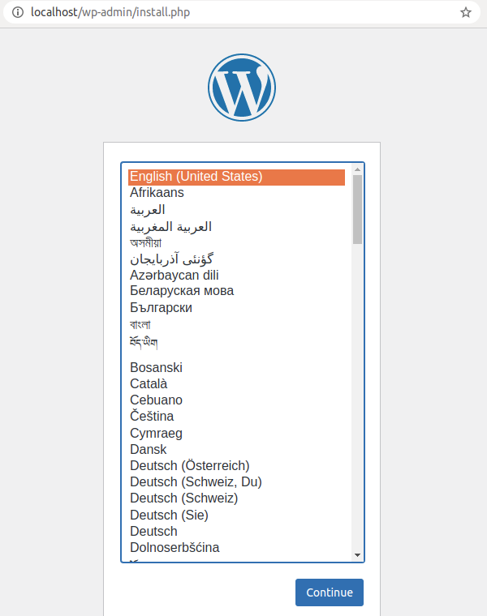

Setup Docker Wordpress
======================

Install Docker
--------------

Docker is getting popular in recent years. It's worth to have a try!

Download Docker `here <https://www.docker.com/get-started>`_.
Follow the `installation instructions <https://docs.docker.com/engine/install/ubuntu/>`_.
Or follow :ref:`the tutorial here (TODO: comming soon for Windows) <install-docker>`.

For now, you can think Docker is an advanced virtual machine and can work everywhere.
So Wordpress can provide web page service on it.

Setup Wordpress
---------------

`Wordpress <https://wordpress.org/>`_ is a website builder with support from
developers all over the world. And Docker provide us a quick way to use it::

::

    docker pull wordpress

Once Wordpress image is ready, we can start and run our first web server like this:

::

    docker run --name wp -e WORDPRESS_DB_HOST=<mysql-host>:3306 -e WORDPRESS_DB_NAME=<...> -e WORDPRESS_DB_USER=<user-name> -e WORDPRESS_DB_PASSWORD=<user-pswd> -dp 80:80 --rm wordpress

You should get something like::

    193e3fc1081e3167f631fe0b71a4fe64415a736fa64295488d8b70478287efd0

Which is the container Id.

Now visit the address in a browser::

    http://localhost

and you should see something like this:

That's it.

Wordpress Hands on
------------------

Follow the previous step, setup your manager account, then your website dashboard
should look like this:

.. image:: ../imgs/03-wordpress-setup.png

To publish your first page, you can click *New* in the top banner or *Pages* in
navigator at the left side.

The page editing is basically *What You See Is What You Get*. You can *preview* or
see the final results in public site following the URL at the right side.

Now you can publish the page. Your first website is working!

The next step is to consider hosting your website on a public accessible server.
Before doing this, you already got advantage that your website image can be moved
anywhere in hole image of Docker. And many cloud service support Docker.

Before moving your website from server to server, you'd better host your image at
Docker Hub.

The first thing you might want to change is the site's favicon. You can follow this
`blog <https://yoast.com/how-to-change-your-favicon-in-wordpress-a-step-by-step-guide/>`_
to customize.

To get maximum visial effects of your site, you are suggested following some video
tutorial of Wordpress to get yourself familiar this it.

Play with Docker Labs (Optional)
--------------------------------

Docker Hub is a cloud service free to save Docker images. Before you can install
docker, you can to `register at Docker Hub <https://hub.docker.com/>`_ and play
with Wordpress at `Dock Labs <https://labs.play-with-docker.com/>`_.

Once you sign up, you can login in with Docker and pull Wordpress and start it (
click ADD NEW INSTANCE)::

    docker pull wordpress
    docker run --name wp -e WORDPRESS_DB_HOST=<mysql-host>:3306 -e WORDPRESS_DB_NAME=<...> -e WORDPRESS_DB_USER=<user-name> -e WORDPRESS_DB_PASSWORD=<user-pswd> -dp 80:80 --rm wordpress

.. note:: If your connection is slow, you need key-in slowly.
..

Then copy the address to your browser's.

.. image:: ../imgs/05-wp-docker-labs.png

After the image is running, open the site by clicking the link shown above, you
should see the page:

.. image:: ../imgs/06-wp-docker-lab-page0.png

This is a quick way to verify your Mysql connection is setup correctly.

Now go to Docker Labs (click Labs at Docker Hub page). Once logged in and created
a new node, you can pull down your image uploaded just now. You can verify everyone
can work with it or can be used latter on other servers.
