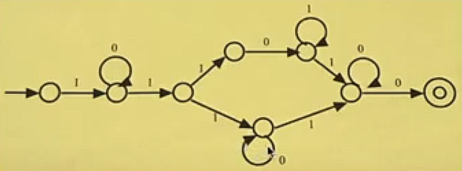

Topics
======

Boolean Algebra
---------------

ACSL Topics: `Boolean Algebra <http://www.categories.acsl.org/wiki/index.php?title=Boolean_Algebra>`_

Data Structures
---------------

ACSL Topics: `Data Structure <http://www.categories.acsl.org/wiki/index.php?title=Data_Structures>`_

How many nodes have only one child in the binary search tree for::

    WINDSORCONNECTICUT

.. image:: ../img/05-tree.jpg
    :width: 420px

FSAs and Regular Expressions
----------------------------

ACSL Topics: `FSA & ReqEx <http://www.categories.acsl.org/wiki/index.php?title=FSAs_and_Regular_Expressions>`_

`Python RegEx <https://www.w3schools.com/python/python_regex.asp>`_ &
`C++ RegEx <https://en.cppreference.com/w/cpp/regex>`_

Ex1. Which, if any, of the following regular expressions are equivalent?

    A. :math:`(a | b)(a b*)(b* | a)`
    B. :math:`(aab* | bab*)a`
    C. :math:`aab* | bab* | aaba | bab*a`
    D. :math:`aab* | bab* | aab*a | bab*a`
    E. :math:`a* | b*`

- B end with 'a'

- E will like aa... b...

- :math:`C \neq D` as b* is not b

- expand A::

    a a b... [b... a]
        -> a a b*
        -> a a b* a
    b a b... [b... a]
        -> b a b*
        -> b a b* a

:math:`aab* | bab* | aaba | bab*a`

Ex2. FSA to RegEx

Solution: :math:`10*11((01*)|0*)10*0`

Handout
-------

Lec 5. Short Problems
