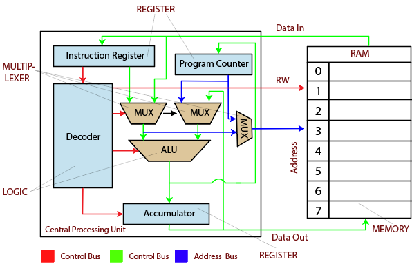
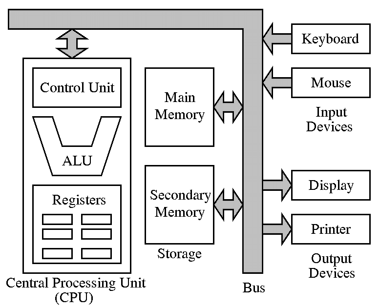

Contest4 Topics
===============

Graph Theory
------------

Prerequisite: Matrix Multiplication
___________________________________

A matrix can be used to represent paths from i to j if :math:`a_{ij} = 1`.

.. math::

    a = \left[\begin{array}{lcr}
    0 & 1 & 0 \\
    1 & 0 & 0 \\
    0 & 0 & 0
    \end{array}\right]
..

Matrix multiplication is defined as:

for n x m matrix A, m x k matrix B,

.. math::

    A \cdot B = C
..

where C is a n x k matrix,

.. math::

    \sum_{t=0}^m a_{jt} \cdot b_{tj} = c_{ij}.
..

Example, :math:`A_{2x4} \cdot M_{4x3} = C_{2x3}`

.. math::

    \begin{bmatrix}
    a_{00} & a_{01} & a_{02} & a_{03} \\
    a_{10} & a_{11} & a_{12} & a_{13}
    \end{bmatrix}
    \begin{bmatrix}
    m_{00} & m_{01} & m_{02} \\
    m_{10} & m_{11} & m_{12} \\
    m_{20} & m_{21} & m_{22} \\
    m_{30} & m_{31} & m_{32}
    \end{bmatrix} =
    \begin{bmatrix}
    c_{00} & c_{01} & c_{02} \\
    c_{10} & c_{11} & c_{12}
    \end{bmatrix}
..

where :math:`c_{00} = a_{00} \cdot b_{00} + a_{01} \cdot b_{10} + a_{02}\cdot b_{20} + a_{03} \cdot b_{30}`.

Graph Path
__________

In a n nodes graph, paths of length 2 from node i to node j are:

.. math::

    \begin{align}
    & n_i \rightarrow n_0 \rightarrow n_j \\
    & n_i \rightarrow n_1 \rightarrow n_j \\
    & ... \\
    & n_i \rightarrow n_{n-1} \rightarrow n_j
    \end{align}
..

Possible paths from :math:`n_i` to :math:`n_j` can be:

.. math::

    a_{i0} \cdot a_{0j} + a_{i1} \cdot a_{1j} + ... + a_{i(n-1)} \cdot a_{(n-1)j}
..

where :math:`a_{ij}` can be either 1 or 0, stands for a path from i to j or not.

A length 2 path matrix can be multiplication of 2 matrix:

.. math::

    \begin{bmatrix}
    a_{00} & a_{01} & a_{02} & a_{03} \\
    a_{10} & a_{11} & a_{12} & a_{13} \\
    a_{20} & a_{21} & a_{22} & a_{23} \\
    a_{30} & a_{31} & a_{32} & a_{33}
    \end{bmatrix}
    \begin{bmatrix}
    a_{00} & a_{01} & a_{02} & a_{03} \\
    a_{10} & a_{11} & a_{12} & a_{13} \\
    a_{20} & a_{21} & a_{22} & a_{23} \\
    a_{30} & a_{31} & a_{32} & a_{33}
    \end{bmatrix} =
    \begin{bmatrix}
    b_{00} & b_{01} & b_{02} & b_{03} \\
    b_{10} & b_{11} & b_{12} & b_{13} \\
    b_{20} & b_{21} & b_{22} & b_{23} \\
    b_{30} & b_{31} & b_{32} & b_{33}
    \end{bmatrix}
..

ACSL Sample Problem 2
_____________________

Paths:

.. math::

    \begin{align}
    & A \rightarrow A & B \rightarrow B \\
    & A \rightarrow C & C \rightarrow A \\
    & B \rightarrow C &
    \end{align}
..

In matrix:

.. math::

    M =
    \begin{bmatrix}
    1 & 0 & 1 \\
    0 & 1 & 1 \\
    1 & 0 & 0
    \end{bmatrix},
    M^2 =
    \begin{bmatrix}
    2 & 0 & 1 \\
    1 & 1 & 1 \\
    1 & 0 & 1
    \end{bmatrix},
    M^4 =
    \begin{bmatrix}
    5 & 0 & 3 \\
    4 & 1 & 3 \\
    3 & 0 & 2
    \end{bmatrix}
..

Digital Electronics
-------------------

We've already done :ref:`here <digit-electronics>`.

Assembly Language
-----------------

`ACSL Topic: Assembly Language <http://www.categories.acsl.org/wiki/index.php?title=Assembly_Language_Programming>`_

In the previous section, we already implemented a simple ALU that can do Addition
and Subtraction. A simple CPU (Control Process Unit) can like this:

..

`Source <https://www.proprofs.com/quiz-school/story.php?title=computer-organization>`__

A simple computer organization:

..

`Source <http://www.simplecpudesign.com/simple_cpu_v1/>`__

This structure help us understand how computer program works, it's all code and
data stored in memory. The code is actually assembly program.

*ACSL chose to define its own assembly language rather than use a “real” one in
order to eliminate the many sticky details associated with real languages*. Be
familiar with the `OPCODE <http://www.categories.acsl.org/wiki/index.php?title=Assembly_Language_Programming>`_.

**Walk through the OP CODE is a must.**
