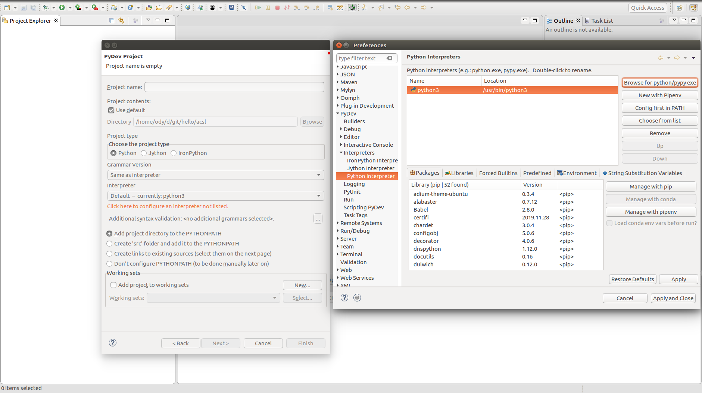
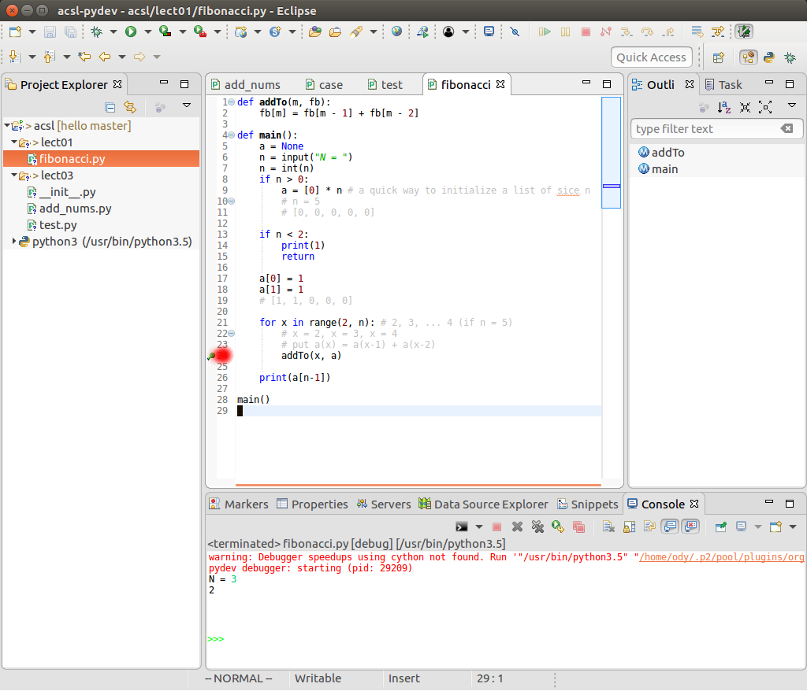
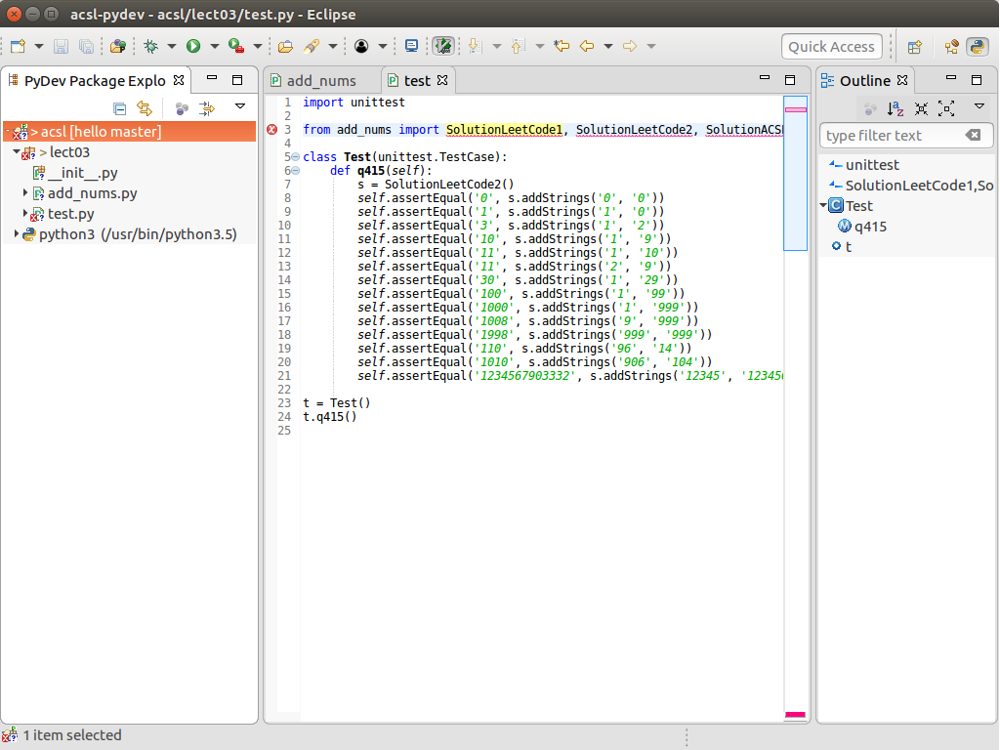

.. _dubg-fibonacci:

Run & Debug with PyDev
======================

Totorial
--------

Wit PyDev, you can run, debug, break and check variable.

1. create a PyDev project
_________________________

After installed PyDev, the file -> new... menu can now create new PyDev project::

    file -> new ... -> others ... -> PyDev -> PyDev Project

Then follow the new project dialog, create a new project.

2. add a source folder
______________________

After project been created, create a new PyDev module by::

    right click in project panel -> new folder

Input folder name: lect01.

3. add a source file
____________________

::

    right click folder -> new file

Input file name: fibonacci.py. Then in the file, past the file content,
`fibonacci.py <https://github.com/odys-z/hello/blob/master/acsl/lect01/fibonacci.py>`_
into your new fibonacci.py file.

4. add a break point
____________________

Set a break point by click at the source file line number.

5. debug
________

Now debug it::

    right click the project -> debug as -> Python Run

With break point stop the program, you can check what's going on at the point,
such as the variables are values like expected.

.. image:: ../img/01-debug-ui.png
	:width: 600px

Trouble Shootings
-----------------

When a new python source module importing another module, e.g. a tester importing
a tested class, Eclipse PyDev may show error markers.

To get rid of the wrong error report::

    right click project -> PyDev -> remove error markers
