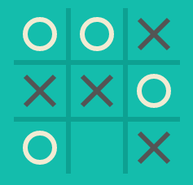
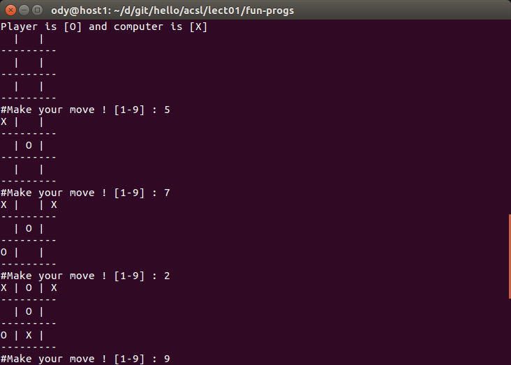

Python Quick Start
==================

Run Python program
------------------

Python syntax can be executed by writing directly in the Command Line::

    >>> print("Hello, World!")
    Hello, World!

Or by creating a python file on the server, using the *.py* file extension, and
running it in the Command Line::

    C:\Users\Your Name>python myfile.py

myfile.py:

.. code-block:: python

    #This is a comment
    print("Hello, World!")
..

Built-in Data Types
-------------------

Variables can store data of different types, and different types can do different
things.

Python's built-in data types by default, in these categories::

    Text Type:      str
    Numeric Types:  int, float, complex
    Sequence Types: list, tuple, range
    Mapping Type:   dict
    Set Types:      set, frozenset
    Boolean Type:   bool
    Binary Types:   bytes, bytearray, memoryview

Getting the Data Type
_____________________

You can get the data type of any object by using the type() function:

Example
_______

Print the data type of the variable x:

.. code-block:: python

    x = 5
    print(type(x))
..

Type Casting
____________

Casting in python is done using constructor functions::

    int() - constructs an integer number from an integer literal, a float literal
            by rounding down to the previous whole number), or a string literal
            (providing the string represents a whole number)
    float() - constructs a float number from an integer literal, a float literal
            or a string literal (providing the string represents a float or an
            integer)
    str() - constructs a string from a wide variety of data types, including
            strings, integer literals and float literals

Example
+++++++

Integers::

    x = int(1)   # x will be 1
    y = int(2.8) # y will be 2

Floats::

    x = float(1)     # x will be 1.0
    y = float(2.8)   # y will be 2.8

Python Collections
------------------

List
____

A list is a collection which is ordered and changeable. In Python list elements
are written with square brackets.

Create a List:

.. code-block:: python

    list1 = ["Papa Rui", "Inuit", "Tibetan"]
    print(list1)
..

You access the list items by referring to the index number:

.. code-block:: python

    # Print the second item of the list:
    list1 = ["Papa Rui", "Inuit", "Tibetan"]
    print(list1[1])
..

Negative Indexing

Negative indexing means beginning from the end, -1 refers to the last item,
-2 refers to the second last item etc.

.. code-block:: python

    # Print the last item of the list:
    list1 = ["apple", "banana", "cherry"]
    print(list1[-1])
..

Range of Indexes

You can specify a range of indexes by specifying where to start and where to end
the range.

When specifying a range, the return value will be a new list with the specified
items.

.. code-block:: python

    list1 = ["apple", "banana", "cherry", "orange", "kiwi", "melon", "mango"]

    # Return the third, fourth, and fifth item:
    print(list1[2:5])

    # This example returns the items from "cherry" and to the end:
    print(list1[2:])

    # This example returns the items from index -4 (included) to index -1 (excluded)
    print(list1[-4:-1])
..

Tuple
_____

A tuple is a collection which is ordered and unchangeable. In Python tuples are
written with round brackets. (Vector)

.. code-block:: python

    # Return the third, fourth, and fifth item:
    tuple1 = ("apple", "banana", "cherry", "orange", "kiwi", "melon", "mango")
    print(tuple1[2:5])

    # this is another powerful feature of Python
    # x = 3, ...
    x, y, z = 3, 4, 5
    a = (x, y, z, 1)
    # a: (3, 4, 5, 1)
..

Map (Python Dict)
_________________

A collection which is unordered, changeable and indexed

.. code-block:: python

    dict1 = {
        "brand": "Ford",
        "model": "Mustang",
        "year": 1964
    }

    # change value
    dict1["year"] = 2018

    # Loop Through a Dictionary
    '''
    model
    brand
    year
    '''
    for x in dict1:
        print(x)

    # check if key exists
    if "model" in dict1:
        print("Yes, 'model' is one of the keys in the dictionary")
..

Set
___

A set is a collection which is unordered and un-indexed. In Python, sets are
written with curly brackets.

.. code-block: python

    # Create a Set:
    acsl = {"Python", "Java", "C++"}
    print(acsl)

    # add multiple items
    acsl.update(["C#", "Javascript", "R"])
..

And More
________

More things you may want to know:

Lambda, RegEx, Class, Module, Math, Pip ...

Resource: `ptyon.org <https://www.python.org/>`_,
especially the `Beginner's Guide <https://wiki.python.org/moin/BeginnersGuide/NonProgrammers>`_

Exercise
--------

Time for fun...

Task 1: Fibonacci Number
________________________

Have user input a number n, then print the n-th Fibonacci number.

Tip 1:

Pick the user input::

    # Return is the user input
    input("Message goes here")

Tip 2:

For loop::

    for x in range(1, n)
        print(x)

While loop::

    while true
       if x >= n:
           break

For Beginner:

According to some questions from beginners, if this is the first time of your
reading a program, it may still feel confused about the source code. There are
some knowledge you should know first.

- Array Access

- Function and Variable Scope

- range() and loop control

Task 2: Guess the number
________________________

This program generates a random number from 1 to 10, or any range that is specified
and the user must guess the number after a hint from the computer. Every time a
user’s guess is wrong they are prompted with more hints to make it easier for
them to guess the number but at the cost of reducing the score.

The program use *input( )* functions to check if an actual number is entered by
the user or not, to compare the input number with the actual number, to find the
difference between the two numbers.

.. note:: play the game, you will get where the binary search algorithm intuition
    come from.
..

.. code-block:: python

    """ Number Guessing Game
    ----------------------------------------
    """

    import random
    attempts_list = []
    def show_score():
        if len(attempts_list) <= 0:
            print("There is currently no high score, it's yours for the taking!")
        else:
            print("The current high score is {} attempts".format(min(attempts_list)))

    def start_game():
        random_number = int(random.randint(1, 10))
        wanna_play = "yes"
        attempts = 0
        show_score()

        while wanna_play.lower() == "yes":
            try:
                guess = input("Pick a number between 1 and 10 ")
                if int(guess) < 1 or int(guess) > 10:
                    raise ValueError("Please guess a number within the given range")
                if int(guess) == random_number:
                    print("Nice! You got it!")
                    attempts += 1
                    attempts_list.append(attempts)
                    print("It took you {} attempts".format(attempts))
                    play_again = input("Would you like to play again? (Enter Yes/No) ")
                    attempts = 0
                    show_score()
                    random_number = int(random.randint(1, 10))
                    if play_again.lower() == "no":
                        print("That's cool, have a good one!")
                        break
                elif int(guess) > random_number:
                    print("It's lower")
                    attempts += 1
                elif int(guess) < random_number:
                    print("It's higher")
                    attempts += 1
            except ValueError as err:
                print("Oh no!, that is not a valid value. Try again...")
                print("({})".format(err))
        else:
            print("That's cool, have a good one!")

    if __name__ == '__main__':
        start_game()
..

Task 3: Tic Tac Toe
___________________

This is a simple game:

The python version played like this:

Reference
=========

`Task reference implementation <https://github.com/odys-z/hello/tree/master/acsl/lect01>`_.

`Cool, Fun & Easy Python Projects for Beginners (with Code) <https://hackr.io/blog/python-projects>`_
