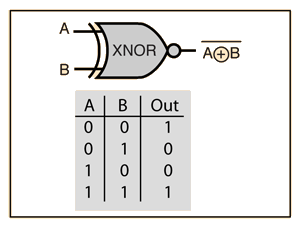
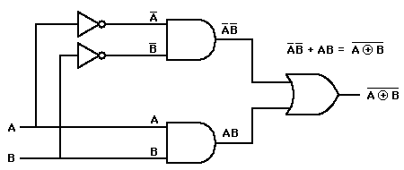

Boolean Algebra
===============

`ACSL Topic: Boolean Algebra <http://www.categories.acsl.org/wiki/index.php?title=Boolean_Algebra>`_

Topic Summery
-------------

- Procedence::

    NOT > AND > XOR/XNOR > OR

- Laws

Idempotent Law:

/ˌʌɪdɛmˈpəʊt(ə)nt, ʌɪˈdɛmpət(ə)nt/

Operation applied multiple times without changing the result beyond the initial
application.

.. math::

    x + x = x \quad x ⋅ x = x`
..

Annihilator: :math:`x + 1 = 1 \quad x ⋅ 0 = 0`

Complement Law: :math:`x+\bar{x}=1 \quad x⋅\bar{x}=0`

Absorptive Law:

.. math::

    x+xy=x
    x+\bar{x}y=x+y  \quad - easily \space forgotten
..

Distributive Law & DeMorgan's Law

Relationship between XOR and XNOR: :math:`\quad x⊙y=\overline{x⊕y}=x⊕\bar{y}=\bar{x}⊕y`

.. math::

    \begin{array}{cc|cc|cc}
    x & y & XOR & XNOR & x⊕\bar{y} & \bar{x}⊕y \\
    \hline
    0 & 0 &  0  &   1  &  0 ⊕ 1 & 1 ⊕ 0 \\
    1 & 0 &  1  &   0  &  1 ⊕ 1 & 0 ⊕ 0 \\
    0 & 1 &  1  &   0  &  0 ⊕ 1 & 1 ⊕ 0 \\
    1 & 1 &  0  &   1  &  1 ⊕ 0 & 0 ⊕ 1 \\
    \hline
    \end{array}
..

XNOR

Quiz
----

`source <http://www.ee.surrey.ac.uk/Projects/Labview/boolalgebra/quiz/index.html>`__

Finish this quiz **without** paper & pencil.

1. Give the relationship that represents the dual of the Boolean property A + 1 = 1?
(Note: * = AND, + = OR and ' = NOT) (2)

::

    (1) A * 1 = 1
    (2) A * 0 = 0
    (3) A + 0 = 0
    (4) A * A = A
    (5) A * 1 = 1

2. Give the best definition of a literal? (3)

::

    (1) A Boolean variable
    (2) The complement of a Boolean variable
    (3) 1 or 2
    (4) A Boolean variable interpreted literally
    (5) The actual understanding of a Boolean variable

3. Simplify the Boolean expression (A+B+C)(D+E)' + (A+B+C)(D+E) and choose the
best answer. (1)

::

    (1) A + B + C
    (2) D + E
    (3) A'B'C'
    (4) D'E'
    (5) None of the above

4. Which of the following relationships represents the dual of the Boolean
property x + x'y = x + y? (5)

::

    (1) x'(x + y') = x'y'
    (2) x(x'y) = xy
    (3) x*x' + y = xy
    (4) x'(xy') = x'y'
    (5) x(x' + y) = xy

5. Given the function F(X,Y,Z) = XZ + Z(X'+ XY), the equivalent most simplified
Boolean representation for F is: (5 [Z])

::

    (1) Z + YZ
    (2) Z + XYZ
    (3) XZ
    (4) X + YZ
    (5) None of the above

6. Simplification of the Boolean expression (A + B)'(C + D + E)' + (A + B)'
yields which of the following results? (2)

::

    (1) A + B
    (2) A'B'
    (3) C + D + E
    (4) C'D'E'
    (5) A'B'C'D'E'

7. Given that F = A'B'+ C'+ D'+ E', which of the following represent the only
correct expression for F'? (5)

::

    (1) F'= A+B+C+D+E
    (2) F'= ABCDE
    (3) F'= AB(C+D+E)
    (4) F'= AB+C'+D'+E'
    (5) F'= (A+B)CDE

8. An equivalent representation for the Boolean expression A' + 1 is

(3)

::

    (1) A
    (2) A'
    (3) 1
    (4) 0

9. Simplification of the Boolean expression AB + ABC + ABCD + ABCDE + ABCDEF
yields which of the following results? (2)

::

    (1) ABCDEF
    (2) AB
    (3) AB + CD + EF
    (4) A + B + C + D + E + F
    (5) A + B(C+D(E+F))

Exercise
--------

1. Express XNOR with AND, OR, NOT.

`source <http://hyperphysics.phy-astr.gsu.edu/hbase/Electronic/xnor.html>`_

2. Truth Sequence of ABC (ordered triples) for :math:`(AB+\bar{C})(\bar{A}+BC)(A+\bar{B}+C)`

answer: [0, 0, 0], [1, 1, 1]

3. Simplification of the expression: :math:`\overline{(\bar{A}+B)}(B+C)\overline{(A+\bar{C})}(A\bar{B}+BC)`

answer: 0

4. Simplify :math:`\overline{ \overline{(A+\overline{B})} (AB) } + \overline{(A+B) \overline{( \overline{A} B)} }`

answer: 1
