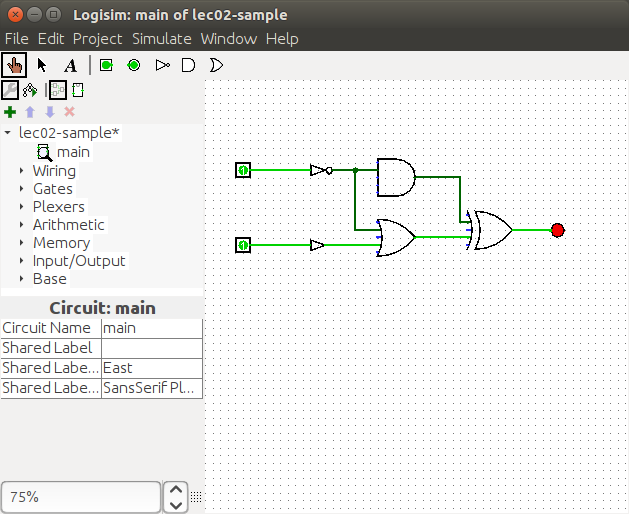

Digital Electronics
===================

Topic Summery
-------------

`ACSL Wiki: Digital Electronics <http://www.categories.acsl.org/wiki/index.php?title=Digital_Electronics>`_

- logic gates

::

    BUFFER  NOT  AND  NAND  OR  NOR  XOR  XNOR

- Logrism

Prerequisite: Java JDK

1. download *Logrism* at `sourceforge <https://sourceforge.net/projects/circuit/>`_

2. run (suppose java program in your PATH, and in the downloaded folder)::

    java -jar logisim-generic-2.7.1.jar

where *logrism-generic-2.7.1.jar* is the downloaded file.

3. create a circuit, try the logic.

Follow the help topic for beginner to create and check the logic.

Here is :download:`a simple circuit <../res/lec02-sample.circ>` created for the
following circuit.

- Find True Tuple

Follow the `Digital Electronics Sample 2 <http://www.categories.acsl.org/wiki/index.php?title=Digital_Electronics>`__,
fill the truth table.

- Simplify Boolean Expression

With help of *Logrism* circuit, you can have a deeper understand of digital circuit.

The following circuit using :download:`this circ file <../res/lec02-sample-3.circ>`.
To have output = 1, the **B xor C** internal results should be "1", which means
both B and C must be "0". This makes no matter what A is, it's impossible to turn
on the other input to "1", then get AND gate output = "1".

Exercise
--------
