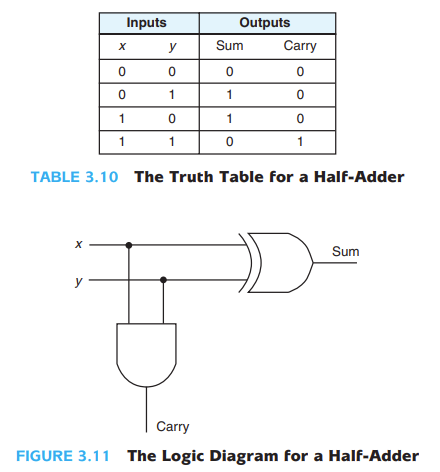
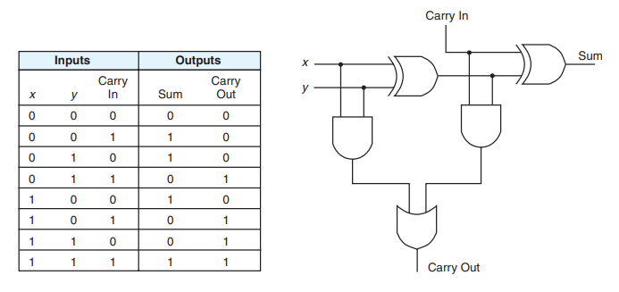
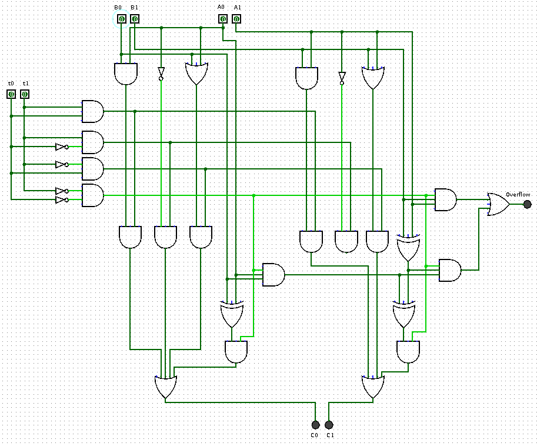

Homework
========

Task 1 Exercise
---------------

1. If a logic function has three inputs, how many rows must the truth table have
to contain all possible states? Justify your answer.

2. For the following functions, construct a truth table and draw a circuit diagram.

    (a). :math:`y(A,B) = \overline{AB}+\overline{B}`

    (b). :math:`y(A,B,C) = \overline{AC} + BC`

    (c). :math:`y(A,B,C) = (A ⨁ B)\overline{C}`

    (d). :math:`y(A,B,C) = \overline{\overline{A+B}\space\overline{B+C}}`

    (e). :math:`y(A,B,C,D) = \overline{A}B\overline{C} + (A ⨁ B)C + \overline{A}\overline{B}C\overline{D} + ABC`

3. Design a 4-input NAND gate using two 2-input NAND gates and one 2-input NOR
gate. Hint: Use DeMorgan's law.

4. Simplify

:math:`\overline{ABC}+ \overline{AB}C+ \overline{A}B\overline{C}+ A\overline{BC}+ A\overline{B}C`

:math:`\overline{\overline{X\overline{Y} + XYZ} + X (Y + X\overline{Y}) }`

:math:`(A + B)(\overline{A} + C)(B + C)`

:math:`XY + \overline{XZ} + X \overline{Y} Z (XY + Z)`

..
    https://docs.google.com/viewer?a=v&pid=sites&srcid=ZGVmYXVsdGRvbWFpbnxzb3VtZW5jYXxneDozOTY2ZjY5ODNmMzhlZjhl

Answer: :math:`(\overline{A}+\overline{B}+\overline{C}), \quad0, \quad AC+B\overline{A}, \quad1`

Reference

..
    https://ufdcimages.uflib.ufl.edu/AA/00/01/16/38/00001/DigitalLogic.pdf

1. James Feher, Introduction to Digital Logic with Laboratory Exercises, Global
Text. (Creative Commons Attribution 3.0 License, Copyright 2009)

2. DIGITALS ELECTRONICS, TYPICAL QUESTIONS & ANSWERS, `Google Docs <https://docs.google.com/viewer?a=v&pid=sites&srcid=ZGVmYXVsdGRvbWFpbnxzb3VtZW5jYXxneDozOTY2ZjY5ODNmMzhlZjhl>`_.

..
    https://mohduzir.uitm.edu.my/digital/DigitalElectronicsSLC.pdf

3. Tertulien Ndjountche, Sequential and Arithmetic Logic Circuits, Digital
Electronics 2, by John Wiley & Sons, Inc. 2016

Task 2. Debunk CPU Myth
-----------------------

After finished this project, you can get a basic idea about the principal of the
CPU's. And would provide a good understand when starting Assembly Language learning.
(There are much more in a CPU)

..
    http://computerscience.jbpub.com/ecoa/2e/Null03.pdf

Reference:

`Essentials of Computer Organization and Architecture, Second Edition, Chapter 3 Boolean Algebra and Digital Logic, Section 3.5.2 Examples of Typical Combinational Circuits <http://computerscience.jbpub.com/ecoa/2e/>`_

Step through the reference examples using *Logisim* to build the logic units:

- Half Adder (One bit ignoring carry)

- Full Adder (Two bit dealing with carry in & carry out)

- 2 Bits Decoder + Output Selector (The function control)

This is comparable to a Multiplexer. See `Toturialspoint, Multiplexer <https://www.tutorialspoint.com/digital_circuits/digital_circuits_multiplexers.htm>`_.

.. image:: ../img/02-decoder.png

- 2 Bits ALU

The finished ALU can be one like in the above. With the control command been set,
finish the following truth table.

Function Selector:

.. math::

    \begin{array}{c|c}
    t1,t0& Function \\
    \hline
    0 0  & A \space and \space  B \\
    0 1  & \overline{A} \\
    1 0  & A \space or \space B \\
    1 1  & A \space and \space B \\
    \hline
    \end{array}
..

- Arithmetic Add

.. math::

    \begin{array}{cc|cc}
    A  & B  & A+B & carry\\
    \hline
    00 & 00 & 00 & 0\\
    00 & 01 &    &  \\
    00 & 10 &    &  \\
    00 & 11 &    &  \\
    11 & 00 &    &  \\
    11 & 01 &    &  \\
    11 & 10 &    &  \\
    11 & 11 &    &  \\
    \hline
    \end{array}
..

If you are interested, you can finish all 4 calculation's truth tables.

Task 3 Prefix Expression *
--------------------------

.. attention:: Try this after the lecture of recursive functions.

Let's rewrite the logic with the following operator:

.. math::

   \begin{array}{c|c}
   \hline
   logic & operator\\
   \hline
   NOT & ! \\
   AND & \&  \\
   OR  & | \\
   XOR & \hat \\
   \end{array}
..

Write the first four expression in step 4, task1 in prefix form. E.g (A OR B) AND
X's prefix form is::

    & | A B X.

Then implement a program to evaluate all answers of question 4 in task 1.

Hint: the important data structure for the program is Stack.
