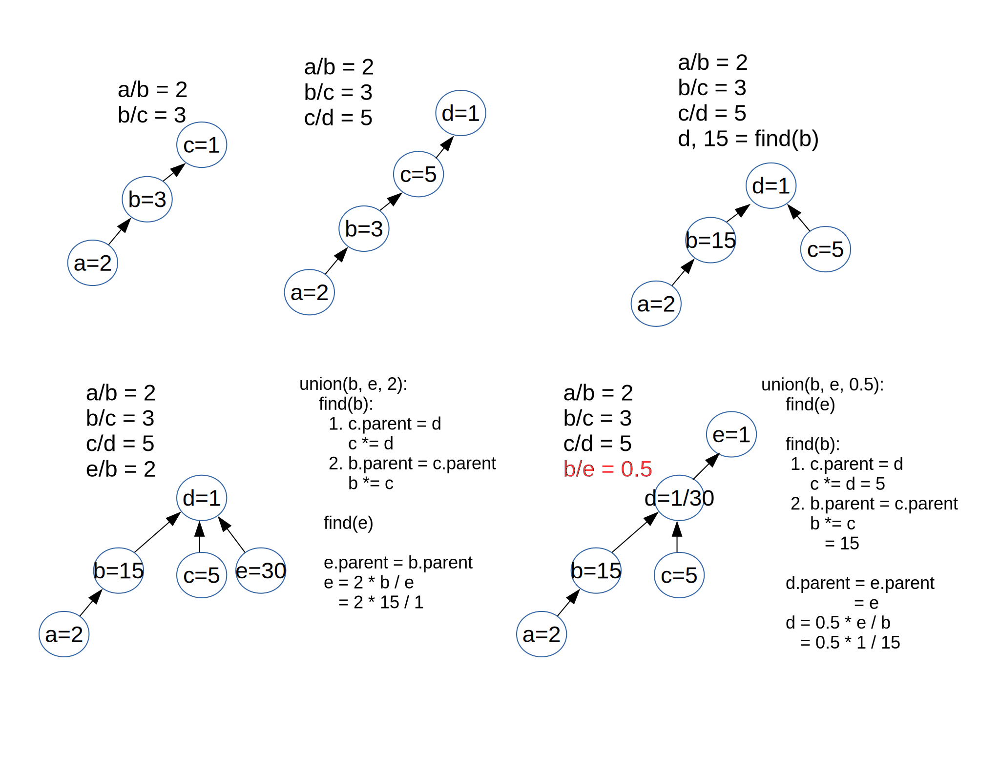

LeetCode Problem Notes
======================

DSU
---

Problems:

`684. Redundant Connection <https://leetcode.com/problems/redundant-connection/>`_

`399 Evaluate Division <https://leetcode.com/problems/evaluate-division/>`_

About DSU (find/union)

See `LeetCode solution, approach 2 <https://leetcode.com/problems/redundant-connection/solution/>`_ &
`the video tutorial <https://www.youtube.com/watch?v=wU6udHRIkcc>`_.

Problem 399 goes further based on DSU algorithm. Here is a detailed explanation
of DSU solution for problem `399 Evaluate Division <https://leetcode.com/problems/evaluate-division/>`_.

Problem 399 description:

    Given an array of variable pairs equations and an array of real numbers values,
    where equations[i] = [Ai, Bi] and values[i] represent the equation

    Ai / Bi = values[i].

    Each Ai or Bi is a string that represents a single variable.

    Also given some queries, where queries[j] = [Cj, Dj] represents the j-th query,
    find the answer for Cj / Dj = ?.

    Return the answers to all queries. If a single answer cannot be determined,
    return -1.0.

Example 1:

Input::

    equations = [["a","b"],["b","c"]],
    values = [2.0,3.0],
    queries = [["a","c"],["b","a"],["a","e"],["a","a"],["x","x"]]

Output::

    [6.00000,0.50000,-1.00000,1.00000,-1.00000]

Explanation:

    Given: a / b = 2.0, b / c = 3.0

    queries are: a / c = ?, b / a = ?, a / e = ?, a / a = ?, x / x = ?

    return: [6.0, 0.5, -1.0, 1.0, -1.0 ]

Almost all DSU problems have DFS/BFS solution. Let's focused on DSU. See discussion

`A union-find without ranking <https://leetcode.com/problems/evaluate-division/discuss/255407/Python-Union-Find>`_.

To construct the DSU sets, we also need to have the equation semantics maintained.

Example:

